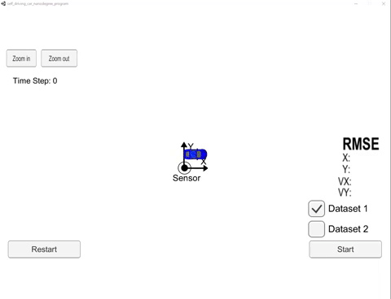
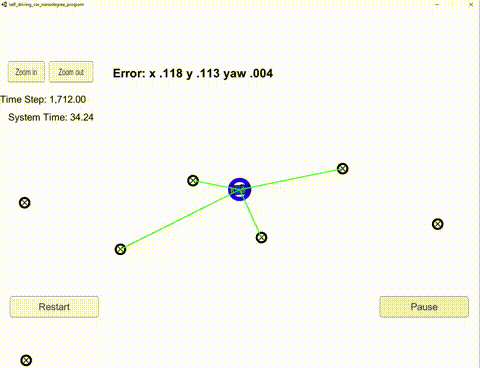

# Self-Driving-Car-Engineer

In this repository I will share the source code of all the projects I have done in Udacity Self-Driving Car Engineer Nanodegree.

I received the [certificate](https://confirm.udacity.com/V3AZPEGW)!

### Term 1: Computer Vision and Deep Learning

| Project Overview | |
| --- | --- |
| **Project 1: Finding Lane Lines on the road** | **Project 2: Traffic Sign Classifier**|
| **Project 3: Behavioral Cloning**  |  **Project 4: Advanced Lane Finding** |

### Term 2: Sensor Fusion, Localization, and Control 
| Project Overview | |
| --- | --- |
| **Project 1: Extended Kalman Filter** | **Project 2: Kidnapped Vehicle**|
| **Project 3: PID Controller**  |  **Project 4: Path Planning** |

